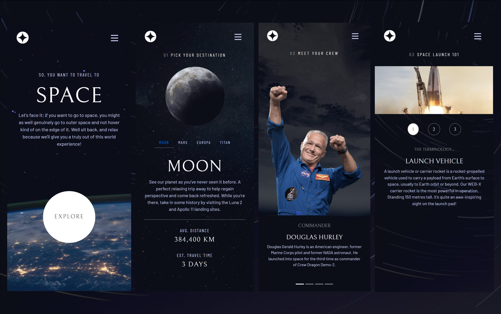

Bem-vindo ao Space Y, uma single page application(SPA) de uma empresa de viagens espaciais.

Projeto construído a partir do desafio disponível da [FrontendMentor](https://www.frontendmentor.io/challenges/space-tourism-multipage-website-gRWj1URZ3). Utilizei o design fornecido pela plataforma e elaborei a página da maneira mais fidedigna possível, desenvolvido com React.js e Bootstrap. E esse foi o meu resultado final 💻<https://space-y-taupe.vercel.app/>.




> Veja o comparativo da minha solução com o resultado esperado, [clicando aqui!](https://www.frontendmentor.io/solutions/space-y-SNmZXUs51o)

</br>

## 🎯 Objetivos

Os usuários devem ser capazes de:

> - Visualizar o layout ideal para cada uma das páginas do site, dependendo do tamanho da tela do dispositivo
> - Visualizar os estados de foco para todos os elementos interativos na página
> - Visualizar cada página e alternar entre as guias para ver novas informações

O objetivo é replicar o design fornecido o mais fielmente possível e garantir o funcionamento das rotas entre cada página e suas guias de informações

</br>

## 🔧 Propriedades e Tecnologias

> - Create React Application (CRA)
> - React
> - React Router DOM v6
> - Bootstrap 4
> - SASS
> - Mobile-first
> - Semântica HTML
> - JSON

</br>

## 🧠 Meu aprendizado

> - React Router DOM v6

O React Router DOM é uma biblioteca poderosa e flexível para a navegação em aplicativos React. Ele fornece uma solução completa para gerenciar as rotas e as transições de página em um aplicativo de uma forma simples e fácil de usar.

Basta instalar a dependência

Terminal:

```html
npm install --save react-router-dom
```

E extrair os Hooks que precisar

```js
import {
  createBrowserRouter,
  createRoutesFromElements,
  Route,
  RouterProvider,
} from "react-router-dom";
```

Com a versão 6, o React Router DOM introduziu uma abordagem baseada em hooks, o que significa que você pode utilizar os novos recursos do React, como o useState e o useEffect, para controlar a navegação e o estado da aplicação.

```js
...
<Route path="/" element={ <Root/> }>
    <Route path="/" element={ <Home/> } />
    <Route path="/destination" element={ <Destination/> }>...
    </Route>
    <Route path="/crew" element={ <Crew/> } />
    <Route path="/technology" element={ <Technology/> } >...
    </Route>
</Route>
...
```

O que essa biblioteca nos proporciona é fenomenal, a junção da sua capacidade de determinar e navegar entre rotas e a estrutura baseada em componente do React, trazem um ganho simplesmente incrivel na produtividade. No exemplo acima vemos a maneira do React Router DOM aplicada em JSX, mas também podemos optar por desenvolver no formato de notação de objeto, [saiba mais!](https://reactrouter.com/en/main/route/route)

</br>

## 💻 Rodando o projeto

Para conferir a versão final é só acessar o link: 💻<https://space-y-taupe.vercel.app/>.

Aqui está uma prévia em vídeo

<video src="./public/preview.mp4" width="1024" height="720" controls>
  Video not supported
</video>

</br>

## Autor

- LinkedIn - [Pedro A. Lima](https://www.linkedin.com/in/pedroalima6/)
